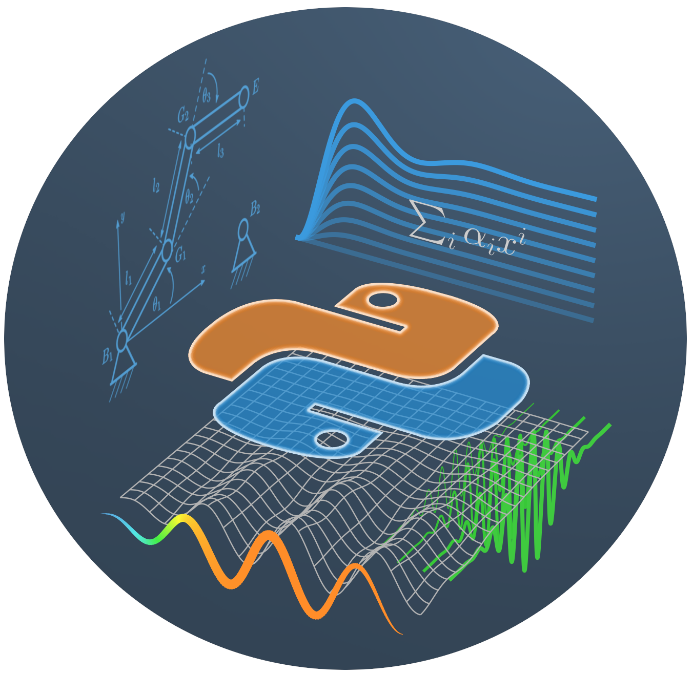

# Python für Ingenieure für Dummies

Dieses Repo enthält (zukünftig) das Begleitmaterial für das Buch **[Python für Ingenieure für Dummies](https://www.wiley-vch.de/de?option=com_eshop&view=product&isbn=9783527717675)**.

**Wichtiger Hinweis:** Bis zur Veröffentlichung des Buches (Oktober 2021) ist dieses Repo experimentell und unvollständig.

## Zusammenhang zwischen Begleitmaterial und Buch

Alle Code-Beispiele ("Schnipsel") im Buch sind kapitelweise in Jupyer-Notebooks hinterlegt und können auf diese Weise direkt (ohne abtippen) ausgeführt werden. Viele der Beispiele erzeugen eine grafische Ausgabe die direkt der jeweiligen Abbildung im Buch entspricht. Damit ist die **Reproduzierbarkeit** der Ergebnisse gewährleistet.

Die Schnipsel werden aus den Notebooks mit einem Skript erzeugt. Alle Code-Zeilen zwischen speziellen Markdown-Zellen (`begin XYZ` und `end XYZ`) werden zu einem Schipsel für das Buch zusammengefasst – bis auf die Zeilen, die mit  dem speziellen Kommentar `#!` enden. Diese werden aus didaktischen Gründen ausgespart. Aus ähnlichen Gründen werden gelegentlich Zeilen in die Buch-Schnipsel eingefügt, die tatsächlich gar nicht ausgeführt werden (Kommentar `#!` am Beginn der Zeile). Das ist zum Beispiel sinnvoll um Code darzustellen, der zu bestimmten Fehlern führt.
